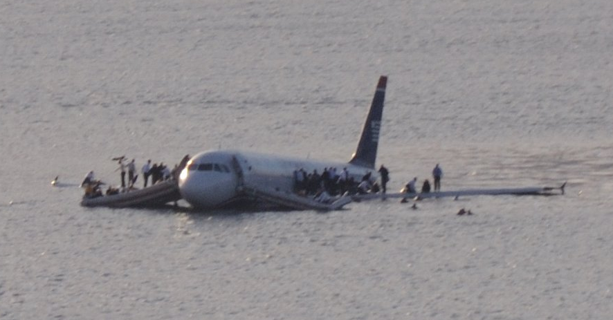

# Land
 You hoped that the pilot would solve the issue, but the plane landed safely in the sea. Now a small boat arrives to carry all the survivors, but it seems like it is about to sink because of the number of people on board, do you [take the boat](boat.md) or [wait another 3 days for the safety crew to get you](wait.md)?
 
 Credit: https://commons.wikimedia.org/wiki/File:Plane_crash_into_Hudson_Rivercroped.jpg, author: Greg L